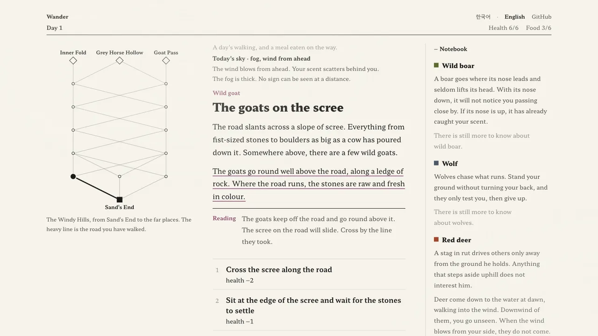

# Wander

A seeded, text-first travel game. Cross a region you do not know, read the signs on the road, and learn what lives there — the only thing you keep from one journey to the next is what you know.

[](https://zeikar.dev/project-wander/)

Play it at [zeikar.dev/project-wander](https://zeikar.dev/project-wander/), in Korean or English.

```bash
npm install
npm run dev
```

The design is in [`VISION.md`](VISION.md); how to work on it is in [`CLAUDE.md`](CLAUDE.md). The first prototype is kept at the `v0-prototype` tag.
